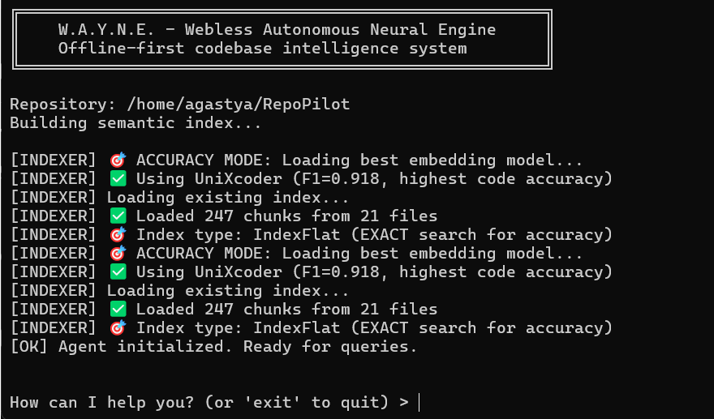

# WAYNE

Webless Autonomous Neural Engine

**A customizable, offline-first alternative for AI-assisted coding.**

[](https://www.python.org)
[](LICENSE)
[](https://github.com/Agastya910/W.A.Y.N.E)

---

## Overview

W.A.Y.N.E. is an open-source AI agent system designed to navigate, understand, and edit codebases entirely on your local machine, and by local machine I do not mean a high end gaming pc or mac studio with 40 GB gpu vram, but your regular pc (having even an entry level GPU with 4GB vram would work wonders, but not necessary, also works on CPU. )

Unlike cloud-based solutions, this runs on your hardware (via Ollama), ensuring that your code never leaves your device, and you own the models so can use them offline for free 24/7.

It is built to be "hackable"—allowing developers to modify the agent's logic, tools, and prompts to fit their specific workflow.

It serves as a private, offline alternative to tools like GitHub Copilot, Cursor, or Gemini CLI, prioritizing data ownership and customizability.

## Philosophy

WAYNE operates under three core principles:

1. **Webless** — No cloud dependency. Fully local.
2. **Autonomous** — Agentic execution with structured reasoning.
3. **Neural Engine** — Powered by local LLMs via Ollama.

Privacy is not a feature. It is the foundation.

---

## ⚡ Core Technical Features

WAYNE implements several architectural patterns to enable effective local code intelligence:

### 1. Local RAG Pipeline

The retrieval system is optimized for code understanding:

- **AST-Aware Chunking**: Parses code structure to keep functions and classes intact.
- **Re-ranking**: Filters irrelevant context using a cross-encoder to maximize the utility of the LLM's context window.

### 2. 3-Layer Memory Architecture

To manage limited context windows (typical of local models), WAYNE uses a tiered memory system:

- **System Context**: Persistent instructions and task state.
- **Summary Layer**: Compressed history of past interactions.
- **Sliding Window**: Raw transcript of recent turns for precise follow-up questions.
  This allows for extended conversations without losing context.

### 3. State-Managed Undo System

WAYNE maintains a deterministic undo stack for all file operations. Every edit is reversible via a simple "undo" command, providing a safety net for refactoring and experimentation.

### 4. Offline & Private

Designed for privacy-sensitive environments:

- **No External API Calls**: Runs on Ollama (`localhost:11434`).
- **Air-Gapped Capable**: Fully functional without an internet connection once models are downloaded.
- **Data Sovereignty**: Your codebase and chat history remain on your local disk.

---

## 📸 Screenshots

### CLI startup and local indexing



### Cloning & analyzing a GitHub repo


---

## 🚀 Quick Start

### 1. Install Prerequisites

- **Python 3.9+**
- **Ollama** – download from [ollama.ai](https://ollama.ai)

### 2. Install Models

```bash
# Embedding model
ollama pull nomic-embed-text

# Reasoning model (Example: Qwen 2.5 7B)
ollama pull qwen2.5:7b-instruct-q4_0
```

### 3. Setup

```bash
git clone https://github.com/Agastya910/W.A.Y.N.E.git
cd W.A.Y.N.E.
pip install -r requirements.txt
```

### 4. Run

```bash
python cli.py .
```

---

## 💡 Usage Examples

### Code Navigation

> _"Explain the authentication flow in `auth_service.py` and draw a mermaid diagram of how user sessions are created."_

### Refactoring & Editing

> _"Find all calls to `deprecated_function` in `src/` and replace them with `new_function`, passing `context=None` as the second argument."_

### Error Correction

> _"That edit broke the tests. Undo the last change to `utils.py`."_

---

## 🏗️ Architecture

The system follows a modular agentic loop:

```
graph TD
    User[User Input] --> Router{Query Router}

    Router -->|Question| Planner
    Router -->|Edit| EditEngine
    Router -->|Undo| Executor

    Planner -->|Needs Context| RAG[RAG Pipeline]
    RAG -->|Retrieve| VectorDB[(FAISS)]
    RAG -->|Re-rank| CrossEncoder

    Planner -->|Plan| Executor
    Executor -->|Tool Calls| Tools[FileIO / Git / Search]

    EditEngine -->|Preview| DiffViewer
    DiffViewer -->|Apply| FileSystem
    FileSystem -->|Log| History[ChatHistory (3-Layer)]
```

**Tech Stack:**

- **Orchestration**: Custom Agent Loop (Planner -> Executor -> Verifier)
- **Memory**: 3-Layer System
- **Retrieval**: FAISS + HyDE + Cross-Encoder
- **LLM**: Ollama (Compatible with Llama 3, Mistral, Qwen, etc.)

---

## 🛠️ Development & Customization

WAYNE is designed to be modified. You can adjust the agent's prompts, add new tools, or swap out the retrieval logic to suit your needs.

```bash
# Run tests
pytest tests/

# Format code
black .
```

## 🤝 Contributing

Contributions are welcome. Please submit a Pull Request.

## FAQ

**Q: Can I use WAYNE with any local model?**
A: Yes, WAYNE supports any model compatible with Ollama, giving you the flexibility to choose models that fit your hardware and performance needs.

**Q: Is my code really safe?**
A: Absolutely. WAYNE runs entirely on your local machine. No code ever leaves your device or is sent to the cloud.

**Q: What does the Y stand for?**
A: It stands for **YOU**, as you have the full control over your stuff.

## 📄 License

MIT License - see [LICENSE](LICENSE) for details.
